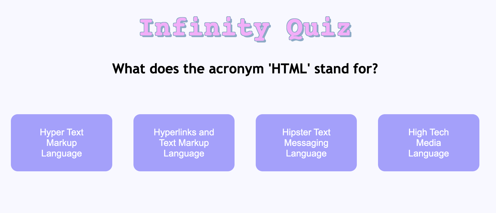

# Infinity Quiz



## Description
Use OpenAIs GPT-3.5 to generate an infinite trivia questions and answers.

Engineer prompts from a list of trivia categories, questions and answers (as "few-shots"). Let the LLM reply with json format. Use the generated prompts to generate more trivia questions and answers. Repeat.

## How to use?
Install the requirements:

```bash
pip install -r requirements.txt
```

Create a `.env` file in [src](/src) with your OpenAI API key:

```bash
# Development settings
OPENAI_API_KEY=YOUR_API_KEY
SECRET_KEY=ANY_SECRET_KEY_STRING
```

Run the server:

```bash
python app.py
```

Then go to [localhost](http://127.0.0.1:5000) (default port is 5000) and start generating trivia questions and answers.

## Prompt Engineering
The prompt is designed as following:

```bash
Generate a new question, in the following (category, subcategory):  

# Randomised from a list of categories and subcategories.
(Technology, Computers and Internet)

# Randomised from a list of example questions and answers.
[{"Question": "Which city is the capital of Australia?", "Options": ["Sydney", "Melbourne", "Canberra", "Perth"], "Answer": "Canberra"}, {"Question": "What planet is known as the 'Red Planet'?", "Options": ["Venus", "Mars", "Jupiter", "Saturn"], "Answer": "Mars"}, {"Question": "Who wrote the novel 'To Kill a Mockingbird'?", "Options": ["Harper Lee", "J.D. Salinger", "George Orwell", "Ernest Hemingway"], "Answer": "Harper Lee"}] 

Provide a json response below: 
```

The response from the example above was:

```json
{
    'Question': "What does the acronym 'HTML' stand for?", 
    'Options': ['Hyper Text Markup Language', 'Hyperlinks and Text Markup Language', 'Hipster Text Messaging Language', 'High Tech Media Language'], 
    'Answer': 'Hyper Text Markup Language'
}
```

I do not enforce the json schema, and completely rely on the LLMs ability to understand the requirements.

I also ask for a rationale, depending on the user's selected option. The rationale has a "mood" parameter, generated from [data/moods.json](data/moods.json).

# TODO
* include category and subcategory in the prompt
* Keep a stack of three questions all the time to avoid latency.
* Add catchy rationale (with source?) to each answer (and option?).
    * Rationale could be generated from the correct question + selected option.
* Store all selected options in a database.
* Rate questions and answers.
* Wrap the generator in a object, so i can call it by `QuizGenerator(category, subcategory, difficulty)`.
* Do it about vett och etikett.
* include a hint in the response.
* add a database to visualise how many questions have been generated, which questions are the most appreciated, and how many incorrect json responses there have been